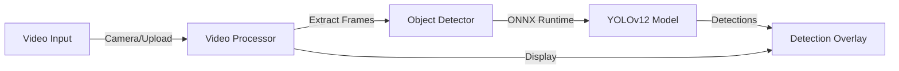

# YOLOv12 ONNX Runtime Web


A minimalistic real-time object detection application built with YOLOv12 and ONNX Runtime Web for browser-based AI inference. Inspired by [Hyuto/
yolov8-onnxruntime-web](https://github.com/Hyuto/yolov8-onnxruntime-web).

## 🎯 Project Overview

This application demonstrates real-time object detection using computer vision. The system processes video streams (uploaded files or live camera) to identify objects in real-time using the YOLOv12 nano model.

### Key Features

- **Real-time Detection**: Processes video at 10+ FPS with live annotation overlays
- **Client-side Processing**: All AI inference happens in the browser (privacy-preserving)
- **Multiple Input Sources**: Supports uploaded video files and live camera streams
- **Minimalistic UI**: Clean, simple interface built with Next.js
- **80 Object Classes**: Detects common objects from the COCO dataset

## 🚀 Quick Start

### Prerequisites

- Node.js 18+ 
- Modern browser with WebGL support (Chrome, Edge, Firefox)
- Camera access (for live detection)

### Installation

1. **Clone and install dependencies:**
   ```bash
   git clone <repository-url>
   cd yolov12-onnxruntime-web
   npm install
   ```

2. **Add the AI model:**
   - Download the YOLOv12n model in ONNX format
   - Place it in `public/models/yolo12n.onnx`
   - Ensure `public/models/model-metadata.json` is configured correctly

3. **Start the development server:**
   ```bash
   npm run dev
   ```

4. **Open your browser:**
   Navigate to `http://localhost:3000`

## 🤖 Model Setup

The application uses the YOLOv12n model in ONNX format for object detection.

### Model Requirements

- **Format**: ONNX (.onnx)
- **Model**: YOLOv12n (nano version for web deployment)
- **Input Size**: 640x640 pixels
- **Classes**: 80 COCO classes (person, car, truck, etc.)

### Getting the Model

1. **Convert to ONNX:**
   - Use the provided `convert_to_onnx.py` script or convert from PyTorch
   - Place the model file in `public/models/yolo12n.onnx`

2. **Verify metadata:**
   - Ensure `public/models/model-metadata.json` contains correct configuration
   - Input size should be `[640, 640]`
   - Classes should include COCO class names

## 🏗️ Architecture



### Technical Architecture

### Frontend Stack
- **Next.js 15**: React framework with App Router
- **React 19**: UI components and state management
- **TypeScript**: Type safety and better development experience
- **Shadcn/ui**: Modern component library with tabs
- **Tailwind CSS**: Utility-first styling

### AI/ML Stack
- **ONNX Runtime Web**: Browser-based AI inference
- **YOLOv12n**: Object detection model architecture
- **Client-side Processing**: No server required, privacy-preserving

### Key Components

```
src/
├── app/
│   └── page.tsx                 # Main application page with tabs
├── components/
│   ├── video-upload.tsx         # File upload interface
│   ├── camera-stream.tsx        # Live camera access
│   ├── detection-overlay.tsx    # Real-time annotation overlay
│   └── stats-panel.tsx          # Statistics and export
├── lib/
│   ├── object-detector.ts       # Core AI detection engine
│   ├── video-processor.ts       # Video frame processing
│   ├── types.ts                 # TypeScript type definitions
│   └── utils.ts                 # Utility functions
└── public/
    └── models/
        ├── yolo12n.onnx         # AI model file
        └── model-metadata.json  # Model configuration
```

## 🎮 Usage Guide

### Video Upload Detection
1. Select the "Video Upload" tab
2. Click "Upload Video File" or drag & drop a video
3. Supported formats: MP4, WebM, MOV, AVI
4. Click "Start Detection" to begin processing
5. Watch real-time object detection with bounding box overlays
6. Use "Pause/Resume" to control processing
7. Export results when finished

### Live Camera Detection
1. Select the "Live Camera" tab
2. Click "Start Camera" and allow camera access
3. Point camera at objects to detect
4. Detection begins automatically
5. View real-time statistics and class breakdown

### Understanding Results
- **Colored boxes**: Different colors for different object classes
- **Confidence scores**: Percentage confidence for each detection
- **Statistics panel**: Shows detection counts and confidence metrics
- **Class breakdown**: Top detected object types

## 📊 Performance Specifications

- **Processing Speed**: 10+ FPS on modern browsers
- **Model Size**: ~6MB (YOLOv12n nano)
- **Browser Support**: Chrome, Edge, Firefox (WebGL required)
- **Memory Usage**: ~200-500MB during processing
- **Accuracy**: 80+ classes from COCO dataset

## 🔧 Configuration

### Model Parameters
Edit `public/models/model-metadata.json` to adjust:
- `confidenceThreshold`: Minimum confidence for detections (0.0-1.0)
- ``nmsThreshold``: Non-maximum suppression threshold (0.0-1.0)
- `inputSize`: Model input dimensions [width, height]
- `classes`: Array of class names for detected objects

### Processing Settings
Modify `src/lib/video-processor.ts`:
- `frameRate`: Frames per second to process (default: 10)
- Detection sensitivity and performance tuning

## 🚨 Troubleshooting

### Common Issues

**"Failed to initialize AI detector"**
- Ensure `yolo12n.onnx` exists in `public/models/`
- Check browser console for detailed error messages
- Verify model is valid ONNX format
- Verify browser supports WebGL and required APIs (check runs automatically on load)

**"Camera access denied"**
- Grant camera permissions in browser settings
- Try refreshing the page
- Use HTTPS in production (required for camera access)

**Poor detection performance**
- Use well-lit, clear video footage
- Ensure objects are visible and distinct
- Try different video angles/distances

**Browser compatibility issues**
- Use Chrome or Edge for best performance
- Application automatically checks for WebGL, MediaStream, and FileReader support on startup
- Update to latest browser version

## 📈 Future Enhancements

### Planned Improvements
- **Custom Model Support**: Interface for uploading custom ONNX models
- **Batch Processing**: Support for multiple video files
- **Advanced Analytics**: Detection heat maps and trend analysis
- **Mobile Optimization**: Touch-friendly interface
- **Real-time Streaming**: WebRTC integration for live streams

### Technical Enhancements
- **Model Optimization**: Quantization and optimization for better performance
- **Multi-threading**: Web Workers for improved processing
- **Caching**: Model and frame caching for better performance
- **API Integration**: RESTful API for external integrations

## 🤝 Contributing

This is an open-source project. For contributions:

1. **Fork the repository**
2. **Create a feature branch**
3. **Make your changes**
4. **Add tests if applicable**
5. **Submit a pull request**

### Development Guidelines
- Follow TypeScript best practices
- Use Prettier for code formatting
- Add JSDoc comments for functions
- Test in multiple browsers

## 📄 License

This project is open source. See LICENSE file for details.

## 🆘 Support

For technical support or questions:
- Check the troubleshooting section above
- Review browser console for error messages
- Ensure all dependencies are properly installed
- Verify model file is correctly placed

---

**Built with Next.js, ONNX Runtime Web, and YOLOv12**
