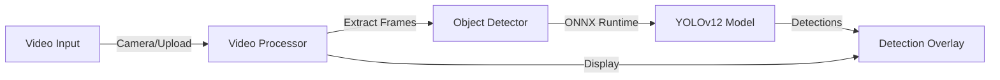

# YOLOv12 ONNX Runtime Web


A minimalistic real-time object detection application built with YOLOv12 and ONNX Runtime Web for browser-based AI inference.

## 🚀 Quick Start

### Prerequisites

- Node.js 20+ 
- Modern browser with WebGPU support (Chrome, Edge, or Firefox)
- Camera access (for live detection)

### Installation

1. **Clone and install dependencies:**
   ```bash
   git clone <repository-url>
   cd ai-object-detector-poc
   npm install
   ```

1. **Start the development server:**
   ```bash
   npm run dev
   ```

1. **Open your browser:**
   Navigate to `http://localhost:5173` (Vite default port)

### Build for Production

```bash
npm run build
```

The built files will be in the `dist` directory, ready to be deployed to GitHub Pages or any static hosting service.

## 🏗️ Architecture



### Technical Architecture

### Frontend Stack
- **Vite**: Fast build tool and dev server
- **React 19**: UI components and state management
- **TypeScript**: Type safety and better development experience
- **Shadcn/ui**: Modern component library with tabs
- **Tailwind CSS**: Utility-first styling

### AI/ML Stack
- **ONNX Runtime Web**: Browser-based AI inference
- **YOLOv12n**: Object detection model architecture
- **Client-side Processing**: No server required, privacy-preserving

### Key Components

- **`src/App.tsx`** - Main application component with tabs for different input modes
- **`src/main.tsx`** - React entry point
- **`src/components/`** - UI components for video upload, camera stream, and detection overlay
- **`src/lib/object-detector.ts`** - Core detection engine using ONNX Runtime
- **`src/lib/video-processor.ts`** - Handles video frame extraction and processing
- **`public/models/`** - YOLOv12 ONNX model and metadata

### Deployment to GitHub Pages

This project is configured for GitHub Pages deployment. The GitHub Actions workflow (`.github/workflows/deploy.yml`) will automatically build and deploy the app when you push to the main branch.

**Important:** Make sure to update the `base` path in `vite.config.ts` to match your repository name if it's different from `ai-object-detector`.

**Built with React, Vite, ONNX Runtime Web, and YOLOv12**

## 🙏 Credits & Inspiration

- **Inspired by:** [Hyuto / yolov8-onnxruntime-web](https://github.com/Hyuto/yolov8-onnxruntime-web)  
- **Stock image:** [Group of people sitting beside rectangular wooden table with laptops — Unsplash](https://unsplash.com/photos/group-of-people-sitting-beside-rectangular-wooden-table-with-laptops-34GZCgaVksk)