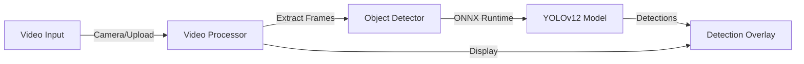

# YOLOv12 ONNX Runtime Web

A minimalistic real-time object detection application built with YOLOv12 and ONNX Runtime Web for browser-based AI inference.

## 🚀 Quick Start

### Prerequisites

- Node.js 18+ 
- Modern browser with WebGL support (Chrome, Edge, Firefox)
- Camera access (for live detection)

### Installation

1. **Clone and install dependencies:**
   ```bash
   git clone <repository-url>
   cd yolov12-onnxruntime-web
   npm install
   ```

1. **Start the development server:**
   ```bash
   npm run dev
   ```

1. **Open your browser:**
   Navigate to `http://localhost:3000`

## 🏗️ Architecture



### Technical Architecture

### Frontend Stack
- **Next.js 15**: React framework with App Router
- **React 19**: UI components and state management
- **TypeScript**: Type safety and better development experience
- **Shadcn/ui**: Modern component library with tabs
- **Tailwind CSS**: Utility-first styling

### AI/ML Stack
- **ONNX Runtime Web**: Browser-based AI inference
- **YOLOv12n**: Object detection model architecture
- **Client-side Processing**: No server required, privacy-preserving

### Key Components

- **`src/app/page.tsx`** - Main page with tabs for different input modes
- **`src/components/`** - UI components for video upload, camera stream, and detection overlay
- **`src/lib/object-detector.ts`** - Core detection engine using ONNX Runtime
- **`src/lib/video-processor.ts`** - Handles video frame extraction and processing
- **`public/models/`** - YOLOv12 ONNX model and metadata

**Built with Next.js, ONNX Runtime Web, and YOLOv12**